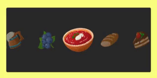
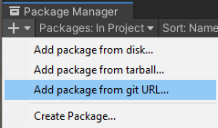

## LightScrollSnap
A simple tool to make unity scrollview to be snapped. It includes some default resources and provides various options as well as writing custom transition effects.



### Installation
- **Install via UPM UI** (git url using unity package manager)  


1) Go Window - Package Manager - Add package from git URL...
2. Paste this url : https://github.com/emrecelik95/LightScrollSnap.git


* **Install via manifest.json file**
1) Navigate to Packages/manifest.json file.
2) Add this into  `"dependencies": {` block
```json
"com.emrecelik95.lightscrollsnap": "https://github.com/emrecelik95/LightScrollSnap.git"
```

*If you don't want to use git, you can download and unzip the repo and move it to Packages folder.*

### Setup

- From Sample  
1) Import the sample from Package Manager -> LightScrollSnap -> Basic Sample.
2) Change the items in **Content** object(Canvas/ScrollSnap/Viewport/Content).
3) Make any configuration using **ScrollSnap** component(Canvas/ScrollSnap).

- From Scratch
1) Create a canvas with screen based **Canvas Scaler**.
2) Create horizontal **ScrollView**.
3) Add **Horizontal Layout Group** and **Content Size Fitter** to **Content** object;
4) Bring the first item to center using **Padding** in **Horizontal Layout Group**.
5) Add **ScrollSnap** component to **ScrollRect** object.
6) Drag **ScrollBarHorizontal** to the **Scrollbar** field on **ScrollSnap** component.
7) Drag any ScrollSnap effects to the Effects field.

### Using Transition Effects

- Transition efffects are based on Scriptable Objects and inherited from **BaseScrollSnapEffect**.
- There are two default effect on this package, to use them, Right Click under Assets, Create -> ScrollSnapEffect.
- To write custom transition effect, just inherit **BaseScrollSnapEffect**.

### Events

- **OnItemSelected** , **OnItemDeselected**, **OnItemClicked**.
- Register and unregister to events; 
```cs
scrollSnap.OnItemSelected.AddListener(OnSelectedItemChanged);
scrollSnap.OnItemSelected.RemoveListener(OnSelectedItemChanged);

private void OnSelectedItemChanged(RectTransform go, int index){}
```

### Some Useful Methods
- ScrollTo(float ratio), SmoothScrollTo(float ratio, float duration) // ratio is between 0 and 1
- ScrollToItem(int itemIndex), SmoothScrollToItem(int itemIndex, float duration)
```cs
scrollSnap.SmoothScrollToItem(5, 0.5f);
```

##### To add click listener to a specific item, use;
- AddItemClickListener(int itemIndex, Action clickListener)  
- RemoveItemClickListener(int itemIndex, Action clickListener
```cs
scrollSnap.AddItemClickListener(0, () => { Debug.Log("First item clicked!"); });
```
